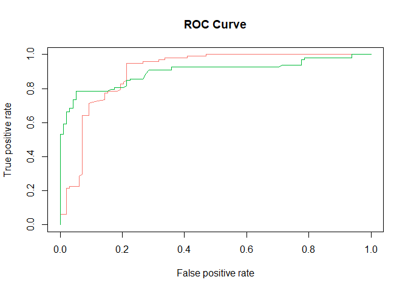
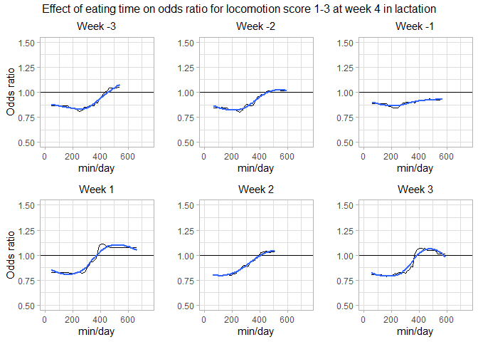
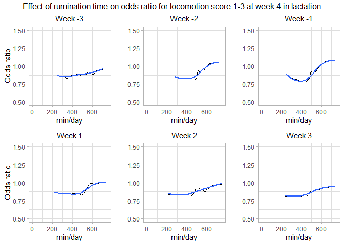
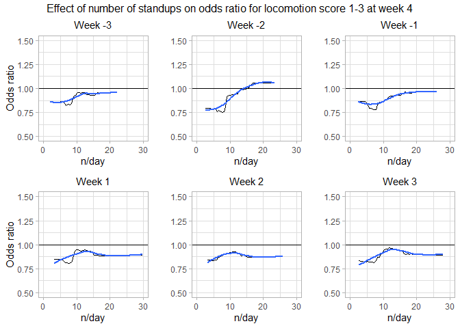

Week 4 locomotion prediction in SenseOfSensors
================

  - [Data extraction, transformation and
    loading](#data-extraction-transformation-and-loading)
      - [Packages loaded](#packages-loaded)
      - [Data anonymisation](#data-anonymisation)
      - [Sensor data](#sensor-data)
          - [Cow features](#cow-features)
          - [Herd features](#herd-features)
      - [Locomotion data](#locomotion-data)
      - [BCS data](#bcs-data)
      - [Combined data](#combined-data)
  - [Random forest prediction locomotion score week
    4](#random-forest-prediction-locomotion-score-week-4)
      - [Create test and training data](#create-test-and-training-data)
      - [Model](#model)
          - [Variable importance](#variable-importance)
          - [Validation](#validation)
  - [Plots](#plots)
      - [Eating time](#eating-time)
      - [Rumination time](#rumination-time)
      - [Standups](#standups)

# Data extraction, transformation and loading

## Packages loaded

``` r
r = getOption("repos")
r["CRAN"] = "http://cran.us.r-project.org"
options(repos = r)

knitr::opts_chunk$set(echo = TRUE)

package_list <- c("readr", "dplyr", "plyr", "tidyr", "stringr", "data.table", "lubridate", "caret", "devtools", "tidyverse", "ggplot2", "pdp", "ROCR")

for (pkg in package_list) {
  if (pkg %in% rownames(installed.packages()) == FALSE)
  {install.packages(pkg)}
  if (pkg %in% rownames(.packages()) == FALSE)
  {library(pkg, character.only = TRUE)}
  print(citation(pkg))
}
```

    ## 
    ## To cite package 'readr' in publications use:
    ## 
    ##   Hadley Wickham and Jim Hester (2020). readr: Read Rectangular Text
    ##   Data. R package version 1.4.0.
    ##   https://CRAN.R-project.org/package=readr
    ## 
    ## A BibTeX entry for LaTeX users is
    ## 
    ##   @Manual{,
    ##     title = {readr: Read Rectangular Text Data},
    ##     author = {Hadley Wickham and Jim Hester},
    ##     year = {2020},
    ##     note = {R package version 1.4.0},
    ##     url = {https://CRAN.R-project.org/package=readr},
    ##   }

    ## 
    ## Attaching package: 'dplyr'

    ## The following objects are masked from 'package:stats':
    ## 
    ##     filter, lag

    ## The following objects are masked from 'package:base':
    ## 
    ##     intersect, setdiff, setequal, union

    ## 
    ## To cite package 'dplyr' in publications use:
    ## 
    ##   Hadley Wickham, Romain François, Lionel Henry and Kirill Müller
    ##   (2020). dplyr: A Grammar of Data Manipulation. R package version
    ##   1.0.2. https://CRAN.R-project.org/package=dplyr
    ## 
    ## A BibTeX entry for LaTeX users is
    ## 
    ##   @Manual{,
    ##     title = {dplyr: A Grammar of Data Manipulation},
    ##     author = {Hadley Wickham and Romain François and Lionel {
    ##              Henry} and Kirill Müller},
    ##     year = {2020},
    ##     note = {R package version 1.0.2},
    ##     url = {https://CRAN.R-project.org/package=dplyr},
    ##   }

    ## ------------------------------------------------------------------------------

    ## You have loaded plyr after dplyr - this is likely to cause problems.
    ## If you need functions from both plyr and dplyr, please load plyr first, then dplyr:
    ## library(plyr); library(dplyr)

    ## ------------------------------------------------------------------------------

    ## 
    ## Attaching package: 'plyr'

    ## The following objects are masked from 'package:dplyr':
    ## 
    ##     arrange, count, desc, failwith, id, mutate, rename, summarise,
    ##     summarize

    ## 
    ## To cite plyr in publications use:
    ## 
    ##   Hadley Wickham (2011). The Split-Apply-Combine Strategy for Data
    ##   Analysis. Journal of Statistical Software, 40(1), 1-29. URL
    ##   http://www.jstatsoft.org/v40/i01/.
    ## 
    ## A BibTeX entry for LaTeX users is
    ## 
    ##   @Article{,
    ##     title = {The Split-Apply-Combine Strategy for Data Analysis},
    ##     author = {Hadley Wickham},
    ##     journal = {Journal of Statistical Software},
    ##     year = {2011},
    ##     volume = {40},
    ##     number = {1},
    ##     pages = {1--29},
    ##     url = {http://www.jstatsoft.org/v40/i01/},
    ##   }
    ## 
    ## 
    ## To cite package 'tidyr' in publications use:
    ## 
    ##   Hadley Wickham (2020). tidyr: Tidy Messy Data. R package version
    ##   1.1.2. https://CRAN.R-project.org/package=tidyr
    ## 
    ## A BibTeX entry for LaTeX users is
    ## 
    ##   @Manual{,
    ##     title = {tidyr: Tidy Messy Data},
    ##     author = {Hadley Wickham},
    ##     year = {2020},
    ##     note = {R package version 1.1.2},
    ##     url = {https://CRAN.R-project.org/package=tidyr},
    ##   }
    ## 
    ## 
    ## To cite package 'stringr' in publications use:
    ## 
    ##   Hadley Wickham (2019). stringr: Simple, Consistent Wrappers for
    ##   Common String Operations. R package version 1.4.0.
    ##   https://CRAN.R-project.org/package=stringr
    ## 
    ## A BibTeX entry for LaTeX users is
    ## 
    ##   @Manual{,
    ##     title = {stringr: Simple, Consistent Wrappers for Common String Operations},
    ##     author = {Hadley Wickham},
    ##     year = {2019},
    ##     note = {R package version 1.4.0},
    ##     url = {https://CRAN.R-project.org/package=stringr},
    ##   }

    ## 
    ## Attaching package: 'data.table'

    ## The following objects are masked from 'package:dplyr':
    ## 
    ##     between, first, last

    ## 
    ## To cite package 'data.table' in publications use:
    ## 
    ##   Matt Dowle and Arun Srinivasan (2020). data.table: Extension of
    ##   `data.frame`. R package version 1.13.2.
    ##   https://CRAN.R-project.org/package=data.table
    ## 
    ## A BibTeX entry for LaTeX users is
    ## 
    ##   @Manual{,
    ##     title = {data.table: Extension of `data.frame`},
    ##     author = {Matt Dowle and Arun Srinivasan},
    ##     year = {2020},
    ##     note = {R package version 1.13.2},
    ##     url = {https://CRAN.R-project.org/package=data.table},
    ##   }

    ## 
    ## Attaching package: 'lubridate'

    ## The following objects are masked from 'package:data.table':
    ## 
    ##     hour, isoweek, mday, minute, month, quarter, second, wday, week,
    ##     yday, year

    ## The following objects are masked from 'package:base':
    ## 
    ##     date, intersect, setdiff, union

    ## 
    ## To cite lubridate in publications use:
    ## 
    ##   Garrett Grolemund, Hadley Wickham (2011). Dates and Times Made Easy
    ##   with lubridate. Journal of Statistical Software, 40(3), 1-25. URL
    ##   http://www.jstatsoft.org/v40/i03/.
    ## 
    ## A BibTeX entry for LaTeX users is
    ## 
    ##   @Article{,
    ##     title = {Dates and Times Made Easy with {lubridate}},
    ##     author = {Garrett Grolemund and Hadley Wickham},
    ##     journal = {Journal of Statistical Software},
    ##     year = {2011},
    ##     volume = {40},
    ##     number = {3},
    ##     pages = {1--25},
    ##     url = {http://www.jstatsoft.org/v40/i03/},
    ##   }

    ## Loading required package: lattice

    ## Loading required package: ggplot2

    ## 
    ## To cite package 'caret' in publications use:
    ## 
    ##   Max Kuhn (2020). caret: Classification and Regression Training. R
    ##   package version 6.0-86. https://CRAN.R-project.org/package=caret
    ## 
    ## A BibTeX entry for LaTeX users is
    ## 
    ##   @Manual{,
    ##     title = {caret: Classification and Regression Training},
    ##     author = {Max Kuhn},
    ##     year = {2020},
    ##     note = {R package version 6.0-86},
    ##     url = {https://CRAN.R-project.org/package=caret},
    ##   }

    ## Loading required package: usethis

    ## 
    ## To cite package 'devtools' in publications use:
    ## 
    ##   Hadley Wickham, Jim Hester and Winston Chang (2020). devtools: Tools
    ##   to Make Developing R Packages Easier. R package version 2.3.2.
    ##   https://CRAN.R-project.org/package=devtools
    ## 
    ## A BibTeX entry for LaTeX users is
    ## 
    ##   @Manual{,
    ##     title = {devtools: Tools to Make Developing R Packages Easier},
    ##     author = {Hadley Wickham and Jim Hester and Winston Chang},
    ##     year = {2020},
    ##     note = {R package version 2.3.2},
    ##     url = {https://CRAN.R-project.org/package=devtools},
    ##   }

    ## -- Attaching packages --------------------------------------- tidyverse 1.3.0 --

    ## v tibble  3.0.4     v forcats 0.5.0
    ## v purrr   0.3.4

    ## -- Conflicts ------------------------------------------ tidyverse_conflicts() --
    ## x plyr::arrange()          masks dplyr::arrange()
    ## x lubridate::as.difftime() masks base::as.difftime()
    ## x data.table::between()    masks dplyr::between()
    ## x purrr::compact()         masks plyr::compact()
    ## x plyr::count()            masks dplyr::count()
    ## x lubridate::date()        masks base::date()
    ## x plyr::failwith()         masks dplyr::failwith()
    ## x dplyr::filter()          masks stats::filter()
    ## x data.table::first()      masks dplyr::first()
    ## x lubridate::hour()        masks data.table::hour()
    ## x plyr::id()               masks dplyr::id()
    ## x lubridate::intersect()   masks base::intersect()
    ## x lubridate::isoweek()     masks data.table::isoweek()
    ## x dplyr::lag()             masks stats::lag()
    ## x data.table::last()       masks dplyr::last()
    ## x purrr::lift()            masks caret::lift()
    ## x lubridate::mday()        masks data.table::mday()
    ## x lubridate::minute()      masks data.table::minute()
    ## x lubridate::month()       masks data.table::month()
    ## x plyr::mutate()           masks dplyr::mutate()
    ## x lubridate::quarter()     masks data.table::quarter()
    ## x plyr::rename()           masks dplyr::rename()
    ## x lubridate::second()      masks data.table::second()
    ## x lubridate::setdiff()     masks base::setdiff()
    ## x plyr::summarise()        masks dplyr::summarise()
    ## x plyr::summarize()        masks dplyr::summarize()
    ## x purrr::transpose()       masks data.table::transpose()
    ## x lubridate::union()       masks base::union()
    ## x lubridate::wday()        masks data.table::wday()
    ## x lubridate::week()        masks data.table::week()
    ## x lubridate::yday()        masks data.table::yday()
    ## x lubridate::year()        masks data.table::year()

    ## 
    ##   Wickham et al., (2019). Welcome to the tidyverse. Journal of Open
    ##   Source Software, 4(43), 1686, https://doi.org/10.21105/joss.01686
    ## 
    ## A BibTeX entry for LaTeX users is
    ## 
    ##   @Article{,
    ##     title = {Welcome to the {tidyverse}},
    ##     author = {Hadley Wickham and Mara Averick and Jennifer Bryan and Winston Chang and Lucy D'Agostino McGowan and Romain François and Garrett Grolemund and Alex Hayes and Lionel Henry and Jim Hester and Max Kuhn and Thomas Lin Pedersen and Evan Miller and Stephan Milton Bache and Kirill Müller and Jeroen Ooms and David Robinson and Dana Paige Seidel and Vitalie Spinu and Kohske Takahashi and Davis Vaughan and Claus Wilke and Kara Woo and Hiroaki Yutani},
    ##     year = {2019},
    ##     journal = {Journal of Open Source Software},
    ##     volume = {4},
    ##     number = {43},
    ##     pages = {1686},
    ##     doi = {10.21105/joss.01686},
    ##   }
    ## 
    ## 
    ## To cite ggplot2 in publications, please use:
    ## 
    ##   H. Wickham. ggplot2: Elegant Graphics for Data Analysis.
    ##   Springer-Verlag New York, 2016.
    ## 
    ## A BibTeX entry for LaTeX users is
    ## 
    ##   @Book{,
    ##     author = {Hadley Wickham},
    ##     title = {ggplot2: Elegant Graphics for Data Analysis},
    ##     publisher = {Springer-Verlag New York},
    ##     year = {2016},
    ##     isbn = {978-3-319-24277-4},
    ##     url = {https://ggplot2.tidyverse.org},
    ##   }

    ## 
    ## Attaching package: 'pdp'

    ## The following object is masked from 'package:purrr':
    ## 
    ##     partial

    ## 
    ## To cite pdp in publications use:
    ## 
    ##   Brandon M. Greenwell (2017). pdp: An R Package for Constructing
    ##   Partial Dependence Plots. The R Journal, 9(1), 421--436. URL
    ##   https://journal.r-project.org/archive/2017/RJ-2017-016/index.html.
    ## 
    ## A BibTeX entry for LaTeX users is
    ## 
    ##   @Article{,
    ##     title = {pdp: An R Package for Constructing Partial Dependence Plots},
    ##     author = {Brandon M. Greenwell},
    ##     journal = {The R Journal},
    ##     year = {2017},
    ##     volume = {9},
    ##     number = {1},
    ##     pages = {421--436},
    ##     url = {https://journal.r-project.org/archive/2017/RJ-2017-016/index.html},
    ##   }
    ## 
    ## 
    ## To cite ROCR in publications use:
    ## 
    ## Sing T, Sander O, Beerenwinkel N, Lengauer T (2005). "ROCR: visualizing
    ## classifier performance in R." _Bioinformatics_, *21*(20), 7881. <URL:
    ## http://rocr.bioinf.mpi-sb.mpg.de>.
    ## 
    ## A BibTeX entry for LaTeX users is
    ## 
    ##   @Article{,
    ##     entry = {article},
    ##     title = {ROCR: visualizing classifier performance in R},
    ##     author = {T. Sing and O. Sander and N. Beerenwinkel and T. Lengauer},
    ##     year = {2005},
    ##     journal = {Bioinformatics},
    ##     volume = {21},
    ##     number = {20},
    ##     pages = {7881},
    ##     url = {http://rocr.bioinf.mpi-sb.mpg.de},
    ##   }
    ## 
    ## We have invested a lot of time and effort in creating ROCR, please cite
    ## it when using it for data analysis.

## Data anonymisation

Make sure you have a file with Anonymization.R which contains some salt
for the anonymisation

``` r
source("../Anonymization.R")
#anony
if (!require("anonymizer")) {
  devtools::install_github("paulhendricks/anonymizer")
  library(anonymizer)
}
```

    ## Loading required package: anonymizer

``` r
citation("anonymizer")
```

    ## Warning in citation("anonymizer"): no date field in DESCRIPTION file of package
    ## 'anonymizer'

    ## 
    ## To cite package 'anonymizer' in publications use:
    ## 
    ##   Paul Hendricks (2020). anonymizer: Anonymize Data Containing
    ##   Personally Identifiable Information. R package version 0.2.2.
    ##   https://github.com/paulhendricks/anonymizer
    ## 
    ## A BibTeX entry for LaTeX users is
    ## 
    ##   @Manual{,
    ##     title = {anonymizer: Anonymize Data Containing Personally Identifiable Information},
    ##     author = {Paul Hendricks},
    ##     year = {2020},
    ##     note = {R package version 0.2.2},
    ##     url = {https://github.com/paulhendricks/anonymizer},
    ##   }

``` r
anoCols <- c("HerdIdentifier", "AnimalIdentifier", "AnimalEartag")
```

## Sensor data

``` r
if(!(exists('AllDataRaw') && is.data.frame(get('AllDataRaw')))) {
  
  files <- list.files("../Data/AllSensorObservationsSarahKuipers07052020/")
  fullFiles <- paste(getwd(), "/Data/AllSensorObservationsSarahKuipers07052020/",files, sep="")
  
  AllDataRaw <- rbind.fill(lapply(fullFiles, fread, header=TRUE, stringsAsFactors = TRUE))

  AllData <- AllDataRaw %>% 
    dplyr::filter(
      LactationNumber > 1 &
      between(DaysInMilk, -21, 20) &
      !is.na(SensorValue)
    ) %>%
    mutate(
      Parity  = recode_factor(LactationNumber,
                              "2" = "2",
                              "3" = "3",
                              .default = "≥4"),
      HerdIdentifier =  as.factor(HerdIdentifier),
      AnimalIdentifier =  as.factor(AnimalIdentifier)
      ) %>% # Only select the necesarry columns
    dplyr::mutate_at(vars(anoCols), anonymizer::anonymize, .char = anoSalt)
}

save(AllData, file = "../Data/AllPredictionData.RData")
```

``` r
load("../Data/AllPredictionData.RData")
```

### Cow features

``` r
PredictionData <- AllData %>%
    dplyr::filter(
      between(DaysInMilk, -21, 20) &
      stringr::str_detect(SensorType, 'Rumination time|Eating time|Lying time|Standup')
      ) %>%
    dplyr::mutate(
                  CalvingDate = case_when(
                    DaysInMilk < 0 ~ as.Date(SubsequentCalvingDate, format="%Y-%m-%dT%H:%M:%OSZ"),
                    TRUE ~ as.Date(CalvingDate, format="%Y-%m-%dT%H:%M:%OSZ"))
                  ,
                  CalvingMonth = format(CalvingDate, "%m"),
                  CalvingSeason = as.factor(
                        case_when(
                          CalvingMonth == "01" ~ "Winter",
                          CalvingMonth == "02" ~ "Winter",
                          CalvingMonth == "03" ~ "Spring",
                          CalvingMonth == "04" ~ "Spring",
                          CalvingMonth == "05" ~ "Spring",
                          CalvingMonth == "06" ~ "Summer",
                          CalvingMonth == "07" ~ "Summer",
                          CalvingMonth == "08" ~ "Summer",
                          CalvingMonth == "09" ~ "Fall",
                          CalvingMonth == "10" ~ "Fall",
                          CalvingMonth == "11" ~ "Fall",
                          CalvingMonth == "12" ~ "Winter",
                          TRUE ~ "Other"
                          )),
                  WeeksInMilk = floor(as.numeric(DaysInMilk)/7),
                  WeeksInMilk = case_when(
                    between(DaysInMilk, -1, 1) ~ "Calving",
                    WeeksInMilk == -3 ~ "WeekPre3",
                    WeeksInMilk == -2 ~ "WeekPre2",
                    WeeksInMilk == -1 ~ "WeekPre1",
                    WeeksInMilk == 0 ~ "WeekPost1",
                    WeeksInMilk == 1 ~ "WeekPost2",
                    WeeksInMilk == 2 ~ "WeekPost3"),
                  AnimalEartag = as.character(AnimalEartag),
                  HerdIdentifier = as.character(HerdIdentifier),
                  AnimalIdentifier = as.character(AnimalIdentifier)
                  ) %>%
    dplyr::group_by(
      HerdIdentifier, 
      AnimalIdentifier,
      AnimalEartag,
      CalvingDate,
      CalvingSeason, 
      Parity,
      LactationNumber,
      SensorType,
      WeeksInMilk
      ) %>% 
  dplyr::summarise(
    AvgSensorValue = mean(SensorValue, na.rm = TRUE)
  ) %>%
  tidyr::unite("SensorWeek", SensorType, WeeksInMilk, sep = "CowAvg") %>%
  tidyr::spread(key = SensorWeek, value = AvgSensorValue, convert = TRUE) %>%
  drop_na()
```

    ## `summarise()` regrouping output by 'HerdIdentifier', 'AnimalIdentifier', 'AnimalEartag', 'CalvingDate', 'CalvingSeason', 'Parity', 'LactationNumber', 'SensorType' (override with `.groups` argument)

### Herd features

``` r
PredictionHerdData <- AllData %>%
    dplyr::filter(
      between(DaysInMilk, -21, 20) &
      stringr::str_detect(SensorType, 'Rumination time|Eating time|Lying time|Standup')
      ) %>%
    dplyr::mutate(
                  PrePostPartum = case_when(
                    between(DaysInMilk, -1, 1) ~ "Calving",
                    DaysInMilk < 0 ~ "Precalving",
                    DaysInMilk > 0 ~ "Postcalving"),
                  AnimalEartag = as.character(AnimalEartag),
                  HerdIdentifier = as.character(HerdIdentifier),
                  AnimalIdentifier = as.character(AnimalIdentifier)
                  ) %>%
    dplyr::group_by(
      HerdIdentifier, 
      SensorType,
      PrePostPartum
      ) %>% 
  dplyr::summarise(
    AvgSensorValue = mean(SensorValue, na.rm = TRUE)
  ) %>%
  tidyr::unite("SensorWeek", SensorType, PrePostPartum, sep = "HerdAvg") %>%
  tidyr::spread(key = SensorWeek, value = AvgSensorValue, convert = TRUE) %>%
  drop_na()
```

    ## `summarise()` regrouping output by 'HerdIdentifier', 'SensorType' (override with `.groups` argument)

## Locomotion data

``` r
LocomotionData <- 
  read_csv(
    "../Data/LocomotionAndBCSData.csv", 
    col_types = cols(
      DaysInMilk = col_integer(), 
      HerdIdentifier = col_character(), 
      LOCO = col_double(), 
      LactationNumber = col_integer())) %>%
  dplyr::mutate(
    CalvingDate = as.Date(CalvingTime, format="%Y-%m-%d"),
    AnimalEartag = as.character(AnimalNumber),
    HerdIdentifier = as.character(HerdIdentifier),
    AnimalIdentifier = as.character(AnimalIdentifier),
    LocomotionScore = as.factor(case_when(
                    LOCO <= 3 ~ "1-3",
                    TRUE ~ "4-5"))
    ) %>% # Only select the necesarry columns
  dplyr::mutate_at(vars(all_of(anoCols)), anonymizer::anonymize, .char = anoSalt) %>%
  dplyr::filter(LactationNumber > 1) %>%
  dplyr::select(
    AnimalIdentifier,
    HerdIdentifier,
    LactationNumber,
    LocomotionScore,
    ObservationPeriod,
    ObservationDate
  )

LocomotionDataWeek4 <- LocomotionData %>% dplyr::filter(ObservationPeriod == "WEEK 4")
```

## BCS data

``` r
BCSData <- 
  read_csv(
    "../Data/LocomotionAndBCSData.csv", 
    col_types = cols(
      DaysInMilk = col_integer(), 
      HerdIdentifier = col_character(), 
      LactationNumber = col_integer())) %>%
  dplyr::mutate(
    CalvingDate = as.Date(CalvingTime, format="%Y-%m-%d"),
    AnimalEartag = as.character(AnimalNumber),
    HerdIdentifier = as.character(HerdIdentifier),
    AnimalIdentifier = as.character(AnimalIdentifier),
    ObservationPeriod = case_when(
                    ObservationPeriod == "BEGIN DROOGSTAND" ~ "BCSEarlyDryPeriod",
                    ObservationPeriod == "EIND DROOGSTAND" ~ "BCSEndDryPeriod",
                    ObservationPeriod == "WEEK 4" ~ "BCSWeek4",
                    TRUE ~ "BCSWeek8"),
    ) %>% # Only select the necesarry columns
  dplyr::mutate_at(vars(anoCols), anonymizer::anonymize, .char = anoSalt) %>%
  dplyr::group_by(
    AnimalIdentifier,
    HerdIdentifier,
    LactationNumber,
    ObservationPeriod
  ) %>%
  dplyr::summarise(BCS = mean(BCS, na.rm = FALSE)) %>%
  tidyr::spread(key = ObservationPeriod, value = BCS, convert = TRUE) %>%
  tidyr::drop_na() %>%
  dplyr::mutate(
    BCSEarlyDryPeriodCat = factor(case_when(
      BCSEarlyDryPeriod < 3.0 ~ "< 3.0",
      BCSEarlyDryPeriod > 3.5 ~ "> 3.5",
      TRUE ~ "3.0 to 3.5"),
      levels= c("< 3.0", "3.0 to 3.5", "> 3.5")
    ),
    BCSEndDryPeriodCat = factor(case_when(
      BCSEndDryPeriod < 3.0 ~ "< 3.0",
      BCSEndDryPeriod > 3.5 ~ "> 3.5",
      TRUE ~ "3.0 to 3.5"),
      levels= c("< 3.0", "3.0 to 3.5", "> 3.5")
    ),
    BCSWeek4Cat = factor(case_when(
      BCSWeek4 < 2.5 ~ "< 2.5",
      BCSWeek4 > 2.75 ~ "> 2.75",
      TRUE ~ "2.5 to 2.75"),
      levels= c("< 2.5", "2.5 to 2.75", "> 2.75")
    ),   
    BCSDeltaDryPeriod = BCSEndDryPeriod - BCSEarlyDryPeriod,
    BCSDeltaTransition =  BCSWeek4 - BCSEndDryPeriod,
    BCSDeltaDryCat = factor(case_when(
      BCSDeltaDryPeriod > 0.25 ~ "Increased more than 0.25",
      BCSDeltaDryPeriod < 0.00 ~ "Decreased",
      TRUE ~ "Stable 0.00 to 0.25"),
      levels= c("Decreased", "Stable 0.00 to 0.25", "Increased more than 0.25")
    ),
    BCSDeltaTransitionCat = factor(case_when(
      BCSDeltaTransition > -0.50 ~ "Decreased less than 0.50",
      BCSDeltaTransition < -0.75 ~ "Decreased more than 0.75",
      TRUE ~ "Decreased between 0.75 to 0.50"),
      levels= c("Decreased more than 0.75", "Decreased between 0.75 to 0.50", "Decreased less than 0.50")
    )
  )
```

    ## Note: Using an external vector in selections is ambiguous.
    ## i Use `all_of(anoCols)` instead of `anoCols` to silence this message.
    ## i See <https://tidyselect.r-lib.org/reference/faq-external-vector.html>.
    ## This message is displayed once per session.

    ## `summarise()` regrouping output by 'AnimalIdentifier', 'HerdIdentifier', 'LactationNumber' (override with `.groups` argument)

## Combined data

``` r
Week4Data <- PredictionData %>%
  inner_join(
    LocomotionDataWeek4,
    by = c("AnimalIdentifier", 
           "HerdIdentifier", 
           "LactationNumber")
    ) %>%
  inner_join(
    BCSData %>% dplyr::select(
      AnimalIdentifier, 
      HerdIdentifier, 
      LactationNumber,
      BCSEarlyDryPeriod,
      BCSEndDryPeriod,
      BCSDeltaDryPeriod,
      BCSDeltaTransition,
      BCSWeek4
    ),
    by = c("AnimalIdentifier", 
           "HerdIdentifier", 
           "LactationNumber")
    ) %>%
  inner_join(
    PredictionHerdData,
    by = c("HerdIdentifier")
  ) %>%
  drop_na()
names(Week4Data) <- gsub("[^[:alnum:]]","",names(Week4Data))
```

# Random forest prediction locomotion score week 4

## Create test and training data

``` r
cols <- colnames(Week4Data)
SensorCols <- cols[grepl("Avg", cols)]
nonSensorCols <- c("Parity",
                   "CalvingSeason", 
                   "BCSEarlyDryPeriod", 
                   "BCSEndDryPeriod", 
                   "BCSDeltaDryPeriod", 
                   "BCSDeltaTransition", 
                   "BCSWeek4")
predictorCols <- c(SensorCols, nonSensorCols)
outcomeCols <- c("LocomotionScore")
allCols <- c(SensorCols, nonSensorCols, outcomeCols)

FullWeek4Data <- Week4Data %>% 
  ungroup() %>% 
  select(one_of(allCols))

table(FullWeek4Data$LocomotionScore)
```

    ## 
    ## 1-3 4-5 
    ## 327 148

``` r
table(Week4Data$HerdIdentifier)
```

    ## 
    ## 22f2796d603699b391d82abfedb1183ec0b7776cc8031ed81fc41b1244a4a46e 
    ##                                                              107 
    ## 50d2c558dd31158feb95ab46c3ae90d9cfacb32af795b524ad16a787af325193 
    ##                                                               39 
    ## 5a425585828b1e1f088098356758a59e5e1742d8b4f16a95d90276aaa2e019c6 
    ##                                                               43 
    ## 6a646e988a5ca60bfeef1f93bfb71ff736984ac36c96235a367cf0cfb773c13e 
    ##                                                               57 
    ## c2b4724d293bbead9d38d2d69cca4c1fae48a1a49c20782e910ba8cc53727c8b 
    ##                                                               55 
    ## f17f0cd29d42edfd5ad3067f376b71f4aa8cfb40089d016ebc303d92f84edf63 
    ##                                                               55 
    ## f5f5d2e3b322b808f6e5b5deba16d813493c24de4e2bd9c1bcc3f353aebee400 
    ##                                                               31 
    ## f767768501fcbffef7158524a3cdf2300910a4096a1f0d992e872c8ae2631e91 
    ##                                                               88

``` r
BalancedWeek4Data <- upSample(
  x = FullWeek4Data[, !names(FullWeek4Data) %in% c("LocomotionScore")],
  y = FullWeek4Data$LocomotionScore)
table(BalancedWeek4Data$Class)
```

    ## 
    ## 1-3 4-5 
    ## 327 327

``` r
trainIndex <- createDataPartition(BalancedWeek4Data$Class, p = .7, 
                                  list = FALSE, 
                                  times = 1)

TrainingFullData <- BalancedWeek4Data[ trainIndex,]
table(TrainingFullData$Class)
```

    ## 
    ## 1-3 4-5 
    ## 229 229

``` r
TestFullData  <- BalancedWeek4Data[-trainIndex,]
table(TestFullData$Class)
```

    ## 
    ## 1-3 4-5 
    ##  98  98

## Model

``` r
rfFormula <- reformulate(
  termlabels = c(SensorCols, nonSensorCols),
  response = "Class"
  )

#10 folds repeat 3 times
control <- trainControl(method='repeatedcv', 
                        number=10, 
                        repeats=3
                     )

#Number randomely variable selected is mtry
mtry <- 3
tunegrid <- expand.grid(.mtry=mtry)

rfClassifier <- train(
  rfFormula, 
  data=as.data.frame(TrainingFullData),
  preProcess=c("scale"),
  method='rf', 
  metric='Accuracy',
  tuneGrid=tunegrid, 
  trControl=control)
print(rfClassifier)
```

    ## Random Forest 
    ## 
    ## 458 samples
    ##  47 predictor
    ##   2 classes: '1-3', '4-5' 
    ## 
    ## Pre-processing: scaled (50) 
    ## Resampling: Cross-Validated (10 fold, repeated 3 times) 
    ## Summary of sample sizes: 412, 412, 412, 413, 412, 412, ... 
    ## Resampling results:
    ## 
    ##   Accuracy   Kappa    
    ##   0.8085346  0.6171618
    ## 
    ## Tuning parameter 'mtry' was held constant at a value of 3

### Variable importance

``` r
varImp(rfClassifier)$importance %>% rownames_to_column() %>% arrange(-Overall)
```

    ##                                   rowname    Overall
    ## 1         EatingtimemindayCowAvgWeekPost3 100.000000
    ## 2         EatingtimemindayCowAvgWeekPost1  99.517939
    ## 3      RuminationtimemindayCowAvgWeekPre1  97.796124
    ## 4               StandupndayCowAvgWeekPre2  93.846244
    ## 5           EatingtimemindayCowAvgCalving  90.803662
    ## 6         EatingtimemindayCowAvgWeekPost2  85.719390
    ## 7      RuminationtimemindayCowAvgWeekPre2  83.691346
    ## 8     RuminationtimemindayCowAvgWeekPost3  79.422084
    ## 9              StandupndayCowAvgWeekPost1  78.459873
    ## 10         EatingtimemindayCowAvgWeekPre2  77.734880
    ## 11    RuminationtimemindayCowAvgWeekPost1  76.830777
    ## 12      RuminationtimemindayCowAvgCalving  76.770597
    ## 13    RuminationtimemindayCowAvgWeekPost2  75.679672
    ## 14              StandupndayCowAvgWeekPre1  75.496111
    ## 15         EatingtimemindayCowAvgWeekPre3  74.574592
    ## 16             StandupndayCowAvgWeekPost2  73.047304
    ## 17              StandupndayCowAvgWeekPre3  72.778297
    ## 18             StandupndayCowAvgWeekPost3  70.202396
    ## 19           LyingtimemindayCowAvgCalving  68.586297
    ## 20         LyingtimemindayCowAvgWeekPost1  66.618377
    ## 21          LyingtimemindayCowAvgWeekPre3  65.681299
    ## 22          LyingtimemindayCowAvgWeekPre1  64.876254
    ## 23         EatingtimemindayCowAvgWeekPre1  64.273739
    ## 24     RuminationtimemindayCowAvgWeekPre3  63.688321
    ## 25          LyingtimemindayCowAvgWeekPre2  60.571101
    ## 26               StandupndayCowAvgCalving  56.877663
    ## 27         LyingtimemindayCowAvgWeekPost2  56.106464
    ## 28         LyingtimemindayCowAvgWeekPost3  54.756787
    ## 29     EatingtimemindayHerdAvgPostcalving  50.774026
    ## 30                               Parity>3  48.834842
    ## 31                        BCSEndDryPeriod  46.659634
    ## 32                     BCSDeltaTransition  45.667903
    ## 33                      BCSEarlyDryPeriod  39.755457
    ## 34                               BCSWeek4  38.843476
    ## 35 RuminationtimemindayHerdAvgPostcalving  35.593035
    ## 36                      BCSDeltaDryPeriod  32.018625
    ## 37           StandupndayHerdAvgPrecalving  28.804523
    ## 38     RuminationtimemindayHerdAvgCalving  28.501357
    ## 39         EatingtimemindayHerdAvgCalving  20.257677
    ## 40      EatingtimemindayHerdAvgPrecalving  17.582160
    ## 41          StandupndayHerdAvgPostcalving  17.212297
    ## 42  RuminationtimemindayHerdAvgPrecalving  16.812257
    ## 43              StandupndayHerdAvgCalving  15.228381
    ## 44       LyingtimemindayHerdAvgPrecalving  14.484757
    ## 45      LyingtimemindayHerdAvgPostcalving  13.071037
    ## 46          LyingtimemindayHerdAvgCalving  12.729039
    ## 47                                Parity3  12.355007
    ## 48                    CalvingSeasonSummer   4.340304
    ## 49                    CalvingSeasonSpring   1.923434
    ## 50                    CalvingSeasonWinter   0.000000

``` r
# varImp(rfClassifier)$importance %>% 
#   as.data.frame() %>%
#   rownames_to_column() %>%
#   arrange(Overall) %>%
#   mutate(rowname = forcats::fct_inorder(rowname )) %>%
#   ggplot()+
#     geom_col(aes(x = rowname, y = Overall))+
#     coord_flip()+
#     theme_bw()
```

``` r
predictionsForROCCurve <- predict(rfClassifier,TestFullData)
library(caret)
confusionMatrix(predictionsForROCCurve, TestFullData$Class)
```

    ## Confusion Matrix and Statistics
    ## 
    ##           Reference
    ## Prediction 1-3 4-5
    ##        1-3  83  20
    ##        4-5  15  78
    ##                                           
    ##                Accuracy : 0.8214          
    ##                  95% CI : (0.7605, 0.8724)
    ##     No Information Rate : 0.5             
    ##     P-Value [Acc > NIR] : <2e-16          
    ##                                           
    ##                   Kappa : 0.6429          
    ##                                           
    ##  Mcnemar's Test P-Value : 0.499           
    ##                                           
    ##             Sensitivity : 0.8469          
    ##             Specificity : 0.7959          
    ##          Pos Pred Value : 0.8058          
    ##          Neg Pred Value : 0.8387          
    ##              Prevalence : 0.5000          
    ##          Detection Rate : 0.4235          
    ##    Detection Prevalence : 0.5255          
    ##       Balanced Accuracy : 0.8214          
    ##                                           
    ##        'Positive' Class : 1-3             
    ## 

### Validation

``` r
# Validation set assessment #2: ROC curves and AUC

# Calculate the probability of new observations belonging to each class
# prediction_for_roc_curve will be a matrix with dimensions data_set_size x number_of_classes
predictionsForROCCurve <- predict(rfClassifier,TestFullData,type="prob")

# Use pretty colours:
prettyColours <- c("#F8766D","#00BA38")

# Specify the different classes 
classes <- levels(TestFullData$Class)

# For each class
for (i in 1:2)
{
 # Define which observations belong to class[i]
 TrueValues <- ifelse(TestFullData[,48]==classes[i],1,0)
 
 # Assess the performance of classifier for class[i]
 Pred <- prediction(predictionsForROCCurve[,i],TrueValues)
 Perf <- performance(Pred, "tpr", "fpr")
 if (i==1)
 {
     plot(Perf,main="ROC Curve",col=prettyColours[i]) 
 }
 else
 {
     plot(Perf,main="ROC Curve",col=prettyColours[i],add=TRUE) 
 }
 
 # Calculate the AUC and print it to screen
 auc.perf <- performance(Pred, measure = "auc")
 print(auc.perf@y.values)
}
```

<!-- -->

    ## [[1]]
    ## [1] 0.8987922
    ## 
    ## [[1]]
    ## [1] 0.8987922

# Plots

## Eating time

``` r
pdp::grid.arrange(
  top = "Effect of eating time on odds ratio for locomotion score 1-3 at week 4 in lactation",
  rfClassifier %>%
    partial(pred.var = "EatingtimemindayCowAvgWeekPre3") %>%
    ggplot(., aes(x=EatingtimemindayCowAvgWeekPre3, y=exp(yhat))) +
    geom_line(stat="identity") + 
    geom_hline(yintercept=1) +
    geom_smooth( se = FALSE) + 
    ylab("Odds ratio") +
    xlab("min/day") +
    xlim(0, 750) +
    coord_cartesian(ylim=c(0.5,1.5)) + 
    theme_light() +
    labs(subtitle = "Week -3") +
    theme(plot.subtitle = element_text(hjust = 0.5)),
  rfClassifier %>%
    partial(pred.var = "EatingtimemindayCowAvgWeekPre2") %>%
    ggplot(., aes(x=EatingtimemindayCowAvgWeekPre2, y=exp(yhat))) +
    geom_line(stat="identity") + 
    geom_hline(yintercept=1) +
    geom_smooth( se = FALSE) + 
    ylab("") +
    xlab("min/day") +
    xlim(0, 750) +
    coord_cartesian(ylim=c(0.5,1.5)) + 
    theme_light() +
    labs(subtitle = "Week -2") +
    theme(plot.subtitle = element_text(hjust = 0.5)),
  rfClassifier %>%
    partial(pred.var = "EatingtimemindayCowAvgWeekPre1") %>%
    ggplot(., aes(x=EatingtimemindayCowAvgWeekPre1, y=exp(yhat))) +
    geom_line(stat="identity") + 
    geom_hline(yintercept=1) +
    geom_smooth( se = FALSE) + 
    ylab("") +
    xlab("min/day") +
    xlim(0, 750) +
    coord_cartesian(ylim=c(0.5,1.5)) + 
    theme_light() +
    labs(subtitle = "Week -1") +
    theme(plot.subtitle = element_text(hjust = 0.5)),
  rfClassifier %>%
    partial(pred.var = "EatingtimemindayCowAvgWeekPost1") %>%
    ggplot(., aes(x=EatingtimemindayCowAvgWeekPost1, y=exp(yhat))) +
    geom_line(stat="identity") + 
    geom_hline(yintercept=1) +
    geom_smooth( se = FALSE) + 
    ylab("Odds ratio") +
    xlab("min/day") +
    xlim(0, 750) +
    coord_cartesian(ylim=c(0.5,1.5)) + 
    theme_light() +
    labs(subtitle = "Week 1") +
    theme(plot.subtitle = element_text(hjust = 0.5)),
  rfClassifier %>%
    partial(pred.var = "EatingtimemindayCowAvgWeekPost2") %>%
    ggplot(., aes(x=EatingtimemindayCowAvgWeekPost2, y=exp(yhat))) +
    geom_line(stat="identity") + 
    geom_hline(yintercept=1) +
    geom_smooth( se = FALSE) + 
    ylab("") +
    xlab("min/day") +
    xlim(0, 750) +
    coord_cartesian(ylim=c(0.5,1.5)) + 
    theme_light() +
    labs(subtitle = "Week 2") +
    theme(plot.subtitle = element_text(hjust = 0.5)),
  rfClassifier %>%
    partial(pred.var = "EatingtimemindayCowAvgWeekPost3") %>%
    ggplot(., aes(x=EatingtimemindayCowAvgWeekPost3, y=exp(yhat))) +
    geom_line(stat="identity") + 
    geom_hline(yintercept=1) +
    geom_smooth( se = FALSE) + 
    ylab("") +
    xlab("min/day") +
    xlim(0, 750) +
    coord_cartesian(ylim=c(0.5,1.5)) + 
    theme_light() +
    labs(subtitle = "Week 3") +
    theme(plot.subtitle = element_text(hjust = 0.5)),
  nrow = 2
  )
```

<!-- -->

## Rumination time

``` r
pdp::grid.arrange(
  top = "Effect of rumination time on odds ratio for locomotion score 1-3 at week 4 in lactation",
  rfClassifier %>%
    partial(pred.var = "RuminationtimemindayCowAvgWeekPre3") %>%
    ggplot(., aes(x=RuminationtimemindayCowAvgWeekPre3, y=exp(yhat))) +
    geom_line(stat="identity") + 
    geom_hline(yintercept=1) +
    geom_smooth( se = FALSE) + 
    ylab("Odds ratio") +
    xlab("min/day") +
    xlim(0, 750) +
    coord_cartesian(ylim=c(0.5,1.5)) + 
    theme_light() +
    labs(subtitle = "Week -3") +
    theme(plot.subtitle = element_text(hjust = 0.5)),
  rfClassifier %>%
    partial(pred.var = "RuminationtimemindayCowAvgWeekPre2") %>%
    ggplot(., aes(x=RuminationtimemindayCowAvgWeekPre2, y=exp(yhat))) +
    geom_line(stat="identity") + 
    geom_hline(yintercept=1) +
    geom_smooth( se = FALSE) + 
    ylab("") +
    xlab("min/day") +
    xlim(0, 750) +
    coord_cartesian(ylim=c(0.5,1.5)) + 
    theme_light() +
    labs(subtitle = "Week -2") +
    theme(plot.subtitle = element_text(hjust = 0.5)),
  rfClassifier %>%
    partial(pred.var = "RuminationtimemindayCowAvgWeekPre1") %>%
    ggplot(., aes(x=RuminationtimemindayCowAvgWeekPre1, y=exp(yhat))) +
    geom_line(stat="identity") + 
    geom_hline(yintercept=1) +
    geom_smooth( se = FALSE) + 
    ylab("") +
    xlab("min/day") +
    xlim(0, 750) +
    coord_cartesian(ylim=c(0.5,1.5)) + 
    theme_light() +
    labs(subtitle = "Week -1") +
    theme(plot.subtitle = element_text(hjust = 0.5)),
  rfClassifier %>%
    partial(pred.var = "RuminationtimemindayCowAvgWeekPost1") %>%
    ggplot(., aes(x=RuminationtimemindayCowAvgWeekPost1, y=exp(yhat))) +
    geom_line(stat="identity") + 
    geom_hline(yintercept=1) +
    geom_smooth( se = FALSE) + 
    ylab("Odds ratio") +
    xlab("min/day") +
    xlim(0, 750) +
    coord_cartesian(ylim=c(0.5,1.5)) + 
    theme_light() +
    labs(subtitle = "Week 1") +
    theme(plot.subtitle = element_text(hjust = 0.5)),
  rfClassifier %>%
    partial(pred.var = "RuminationtimemindayCowAvgWeekPost2") %>%
    ggplot(., aes(x=RuminationtimemindayCowAvgWeekPost2, y=exp(yhat))) +
    geom_line(stat="identity") + 
    geom_hline(yintercept=1) +
    geom_smooth( se = FALSE) + 
    ylab("") +
    xlab("min/day") +
    xlim(0, 750) +
    coord_cartesian(ylim=c(0.5,1.5)) + 
    theme_light() +
    labs(subtitle = "Week 2") +
    theme(plot.subtitle = element_text(hjust = 0.5)),
  rfClassifier %>%
    partial(pred.var = "RuminationtimemindayCowAvgWeekPost3") %>%
    ggplot(., aes(x=RuminationtimemindayCowAvgWeekPost3, y=exp(yhat))) +
    geom_line(stat="identity") + 
    geom_hline(yintercept=1) +
    geom_smooth( se = FALSE) + 
    ylab("") +
    xlab("min/day") +
    xlim(0, 750) +
    coord_cartesian(ylim=c(0.5,1.5)) + 
    theme_light() +
    labs(subtitle = "Week 3") +
    theme(plot.subtitle = element_text(hjust = 0.5)),
  nrow = 2
  )
```

<!-- -->

## Standups

``` r
pdp::grid.arrange(
  top = "Effect of number of standups on odds ratio for locomotion score 1-3 at week 4",
  rfClassifier %>%
    partial(pred.var = "StandupndayCowAvgWeekPre3") %>%
    ggplot(., aes(x=StandupndayCowAvgWeekPre3, y=exp(yhat))) +
    geom_line(stat="identity") + 
    geom_hline(yintercept=1) +
    geom_smooth( se = FALSE) + 
    ylab("Odds ratio") +
    xlab("n/day") +
    xlim(0, 30) +
    coord_cartesian(ylim=c(0.5,1.5)) + 
    theme_light() +
    labs(subtitle = "Week -3") +
    theme(plot.subtitle = element_text(hjust = 0.5)),
  rfClassifier %>%
    partial(pred.var = "StandupndayCowAvgWeekPre2") %>%
    ggplot(., aes(x=StandupndayCowAvgWeekPre2, y=exp(yhat))) +
    geom_line(stat="identity") + 
    geom_hline(yintercept=1) +
    geom_smooth( se = FALSE) + 
    ylab("") +
    xlab("n/day") +
    xlim(0, 30) +
    coord_cartesian(ylim=c(0.5,1.5)) + 
    theme_light() +
    labs(subtitle = "Week -2") +
    theme(plot.subtitle = element_text(hjust = 0.5)),
  rfClassifier %>%
    partial(pred.var = "StandupndayCowAvgWeekPre1") %>%
    ggplot(., aes(x=StandupndayCowAvgWeekPre1, y=exp(yhat))) +
    geom_line(stat="identity") + 
    geom_hline(yintercept=1) +
    geom_smooth( se = FALSE) + 
    ylab("") +
    xlab("n/day") +
    xlim(0, 30) +
    coord_cartesian(ylim=c(0.5,1.5)) + 
    theme_light() +
    labs(subtitle = "Week -1") +
    theme(plot.subtitle = element_text(hjust = 0.5)),
  rfClassifier %>%
    partial(pred.var = "StandupndayCowAvgWeekPost1") %>%
    ggplot(., aes(x=StandupndayCowAvgWeekPost1, y=exp(yhat))) +
    geom_line(stat="identity") + 
    geom_hline(yintercept=1) +
    geom_smooth( se = FALSE) + 
    ylab("Odds ratio") +
    xlab("n/day") +
    xlim(0, 30) +
    coord_cartesian(ylim=c(0.5,1.5)) + 
    theme_light() +
    labs(subtitle = "Week 1") +
    theme(plot.subtitle = element_text(hjust = 0.5)),
  rfClassifier %>%
    partial(pred.var = "StandupndayCowAvgWeekPost2") %>%
    ggplot(., aes(x=StandupndayCowAvgWeekPost2, y=exp(yhat))) +
    geom_line(stat="identity") + 
    geom_hline(yintercept=1) +
    geom_smooth( se = FALSE) + 
    ylab("") +
    xlab("n/day") +
    xlim(0, 30) +
    coord_cartesian(ylim=c(0.5,1.5)) + 
    theme_light() +
    labs(subtitle = "Week 2") +
    theme(plot.subtitle = element_text(hjust = 0.5)),
  rfClassifier %>%
    partial(pred.var = "StandupndayCowAvgWeekPost3") %>%
    ggplot(., aes(x=StandupndayCowAvgWeekPost3, y=exp(yhat))) +
    geom_line(stat="identity") + 
    geom_hline(yintercept=1) +
    geom_smooth( se = FALSE) + 
    ylab("") +
    xlab("n/day") +
    xlim(0, 30) +
    coord_cartesian(ylim=c(0.5,1.5)) + 
    theme_light() +
    labs(subtitle = "Week 3") +
    theme(plot.subtitle = element_text(hjust = 0.5)),
  nrow = 2
  )
```

<!-- -->
